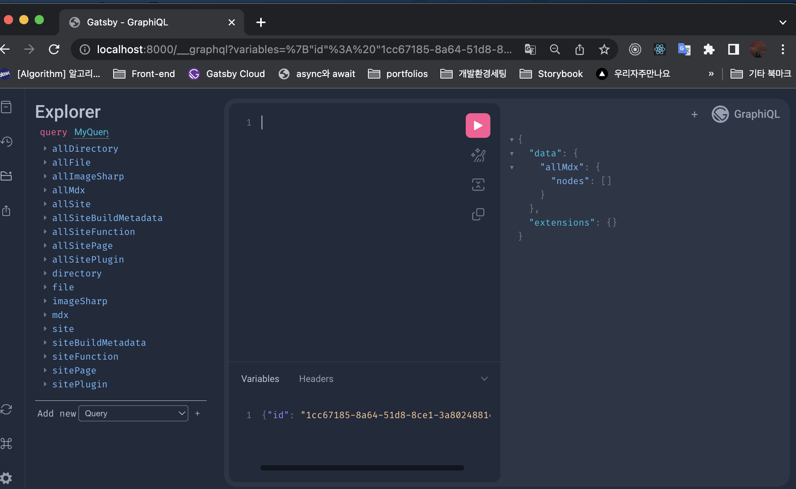
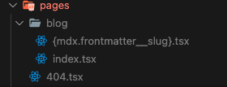

## V5 마이그레이션에 앞서

### Gatsby는 무엇에 집중했나

<iframe
  src="https://giphy.com/embed/rY93u9tQbybks"
  width="480"
  height="200"
  frameBorder="0"
  class="giphy-embed"
  allowFullScreen
></iframe>
<p>
  <a href="https://giphy.com/gifs/great-dicaprio-leonardo-rY93u9tQbybks">
    그 개츠비를 생각한건 저뿐만은 아니었을 거에요..🍷 - via GIPHY
  </a>
</p>

이 블로그는 Gatsby(이하 개츠비)라는 정적 페이지 생성에 특화된 프레임워크로 만들었다.

<aside>
💡 *Gatsby란?*

Jamstack\* 아키텍쳐와 React 기반으로 빠른 빌드타임을 가지며 안전하고 강력한 웹사이트 구현이 가능한 오픈소스 프레임워크로, GraphQL 레이어를 기반으로 데이터를 받아온다.<br />
**_동적인 데이터가 많은 사이트보다는 정적 페이지 생성(SSG - Static Site Generator)에
적합_**한데, 그 예로 블로그, 상품 변화가 많지 않은 상품 소개 페이지 등이 있을 수 있겠다.

\*Jamstack : JavaScript, APIs, HTML markup

</aside>

- 개츠비를 이용하면 웹사이트 빌드 타임에 Pre-rendered된 HTML파일을 바로 가지고 있기 때문에 검색 엔진에 최적화(SEO)되어 있다.
- 개발도 어렵지 않은 편이라 빠르게 블로그나 포트폴리오 사이트를 생성하는데 적합하다고 생각해 나의 개발 블로그 플랫폼으로 개츠비를 골랐다. ✅

[개츠비 공식문서](https://www.gatsbyjs.com/docs/)는 직관적으로 구성되어있어, 개츠비 또는 리액트가 처음인 사람들, 웹 개발에 처음 입문하는 사람들도 따라할 수 있는 튜토리얼 및 Docs를 제공하고 있다. <br />만약 웹 개발을 전혀 모르는(또는 앞으로 학습할 예정이 없는) 일반인이라면 쉽지는 않겠으나 개츠비는 친절하게도 HTML, CSS, JavaScript, React, 커맨드라인툴까지.. 개츠비를 이용하기 전 필요한 학습 과정 및 프로그램에 대해 [소개하고 있으니](https://www.gatsbyjs.com/docs/tutorial/part-0/#background-knowledge) 관심이 있으면 시도해볼만 한 것 같다.

이번에는 기존에 V4로 작업한 내 블로그를 V5로의 마이그레이션하게 되어 그 과정에 대해 기록하지만, 조만간 이 _위대한 개츠비로_ 블로그를 만든 과정에 대해 하나의 글 또는 여러개로 주제를 나누어 포스팅하려고 한다.

## V4에서 V5로

<aside>
💡 아래는 [마이그레이션 공식문서](https://www.gatsbyjs.com/docs/reference/release-notes/migrating-from-v4-to-v5/)를 참조하며 내가 적용한 부분 위주로 소개하려고 한다.

</aside>

### v5에서 추가되는 기능 - Slice API, Partial Hydration

- Slice API 기능은 공통 컴포넌트를 별개의 HTML파일로 분리하여 별개로 빌드하고, 기존 페이지들에 ‘연결’할 수 있게 하는 기능으로, 빌드 타임을 90% 가까이 줄여준다고 한다.
- Partial Hydration 기능은, 브라우저에서 꼭 필요한 자바스크립트만 전달하도록 하는 것인데 이는 코드의 번들링 사이즈를 줄이고, 초기에 적은 코드만을 전달함으로써 로딩 속도도 올린다. 이는 Lighthouse 지표도 크게 올리고, 더 나은 UX를 만들어준다.

이번 마이그레이션에 적용하지는 않았지만, 이번 업데이트의 중점은 더 나은 UX와 성능 최적화인 것으로 보인다.

### V4 → v5로 넘어가기 위해 권장하는 조건

- node 18버전 또는 그 이상
- react 18버전으로의 전환
- codemod라는 개념을 이용한 기존 GraphQl 쿼리의 수정
- latest v4 버전인 개츠비

### Deprecated version 핸들링 처리

```jsx
// v5로 스무스한 업데이트를 위한 latest v4로 만들어주기 위해 CLI에 아래 명령어를 입력하자
npm outdated

// build 이후 로그에 deprecation 메세지들을 보고 fix하자!
gatsby build
```

### 의존 패키지 업데이트

#### 1. Gatsby, React, React-dom

```jsx
// gatsby ^5.0.0
// react ^18.0.0
// react-dom ^18.0.0

// npm 버전이 7이거나 그 이상일때 뒤의 명령어 추가한다
npm install gatsby@latest --legacy-peer-deps

// 아래는 나는 이미 최신 버전이라 실행하지 않았다
npm install react@latest react-dom@latest
```

#### 2. gatsby-\*로 시작하는 패키지

- gatsby-\*로 시작하는 모든 패키지들을 @latest 버전으로 하나씩 업데이트한다.
- npm7 이상 버전을 사용하는 경우 에러가 발생하는데 이는 업데이트하려는 플러그인이 gatsby의 새로운 버전을 포함하기 위해 peerDependency 또한 업데이트 해야하므로 발생하는 에러이다. 이는 플러그인이 호환되지 않는다는 것을 의미할 수 있지만, 대부분의 경우 문제없이 작동한다(고 공식문서에서 이야기하고있다)
  나는 npm 7 이상 버전을 사용하고 있기에 --legacy-peer-deps를 뒤에 붙여주면 해당 에러를 무시하고 원하는대로 latest 버전으로 문제없이 plugin을 업데이트 하였다.

#### 3. 배포할때 이러한 에러가 발생한다면, 루트에 .npmrc 파일을 생성해 아래 코드를 추가하자.

```jsx
npx gatsby-codemods@latest sort-and-aggr-graphql
// 만약 특정 파일/디렉토리에만 적용하고 싶다면 뒤에 <filepath>를 붙여주기
```

### GraphQL Query에 에러

#### 1. codemod


공식문서를 찾아보니 이번 업데이트에서 graphQL 문법이 변경된 부분이 있어 기존 syntax에서 에러가 나는 것이었다. [공식문서](https://www.notion.so/Bon-App-tit-Foodcast-7cc77e741c3348e78bc1d477191fc8ea)에서는 기존에 작성된 쿼리를 사용자가 변경할 일이 없이 새로운 syntax로 변환해서 읽어주는 codemod라는 기능을 제공하고 있어 아래 명령어를 적용하니 해결되었다.

<br />
하지만 이것은 임시방편일 뿐.. 결국은 new syntax로 변경해야 하는데, deprecation 에러를
방지하고 GraphiQL(올바른 GraphQL 쿼리를 작성하게 도와주는 GraphQL IDE)도 문제 없이
동작하도록 하기 위함이라고 한다.

<aside>
  💡 The old syntax will continue to work as Gatsby automatically applies the
  mentioned codemod and transforms your code, however we strongly encourage you
  to permanently migrate your queries to the new syntax. This way you won’t see
  deprecation messages in your terminal and can be sure that the queries work
  in [GraphiQL](https://www.gatsbyjs.com/docs/how-to/querying-data/running-queries-with-graphiql/) (because
  the old ones won’t).
</aside>

#### 2. GraphiQL error



gatsby-plugin-mdx 플러그인은 graphql query에 allMdx, mdx field를 제공해주는데, 이는 .mdx 파일에 대한 데이터를 제공한다.

#### graphiQL query에 frontmatter field가 나오지 않은 이유

블로그 포스트를 작성한 mdx 파일에 대한 데이터를 가져오려고 아래와 같은 쿼리문을 작성했다. (frontmatter는 .mdx 파일 최상단에 작성하는 해당 file의 metadata 집합체를 의미한다)

```jsx
export const query = graphql`
  query MainBlogList {
    allMdx(sort: { frontmatter: { datePublished: DESC } }) {
      nodes {
        frontmatter {
          author
          datePublished
          slug
          thumbnail
          title
        }
        id
        excerpt(pruneLength: 50)
        body
      }
    }
  }
`;
```

GraphiQL tool에서 쿼리를 돌려보는데 분명히 작성한 mdx 파일 내부의 frontmatter field가 graphiQL 내부에 표시되지 않았다.


알아본 결과 frontmatter 내부 공백이 field에 영향을 주는 것 같았다. datePublished value부분에 있던 빈 공백을 지워주니 frontmatter field가 제대로 반영되었다.


누락된 중간과정이 있었는지 한참 찾고 있었는데 그것이 아니어서 오히려 다행이었다.


우선 메인페이지를 로드하는 데는 성공했다.

### 기존과 달라진 dynamic page naming rule

기존에 구현했던 각 dynamic blog post의 파일명은 frontmatter 외부의 slug property를 적용하면서 mdx.slug.tsx였다. <br />syntax의 변경으로 frontmatter내부에 slug를 작성하면서 파일명도 당연히 mdx.frontmatter.slug.tsx로 바뀔것이라 생각했지만 mdx.frontmatter\_\_slug.tsx로 작성하고 나서야 해당 페이지로 문제없이 이동하는 것을 확인했다.



아래는 mdx query를 이용한 각 post에 대한 data를 가져온 것이다


### 더이상 body를 MdxRenderer 컴포넌트로 감싸지 않고 children으로 바로 대체 가능하다


v4에서는 gatsby-plugin-mdx에서 제공하는 MDXRenderer라는 컴포넌트로 아예 body data를 엮어 화면에 렌더할 수 있었는데


v5에서는 Props로 전달받는 children을 그대로 렌더해주면 기존과 같이 블로그 글이 잘 나오는 것을 볼 수 있다!


### 마이그레이션이 마무리되었다

<iframe
  src="https://giphy.com/embed/j0vs5H7Kcz3Pm9LRDa"
  width="480"
  height="412"
  frameBorder="0"
  class="giphy-embed"
  allowFullScreen
></iframe>
<p>
  <a href="https://giphy.com/gifs/myHQ-workspaces-finally-yesss-i-did-it-j0vs5H7Kcz3Pm9LRDa">
    드디어..! via GIPHY
  </a>
</p>


## 참고

- [https://www.gatsbyjs.com/blog/a-look-at-partial-hydration-in-gatsby-5/](https://www.gatsbyjs.com/blog/a-look-at-partial-hydration-in-gatsby-5/)
