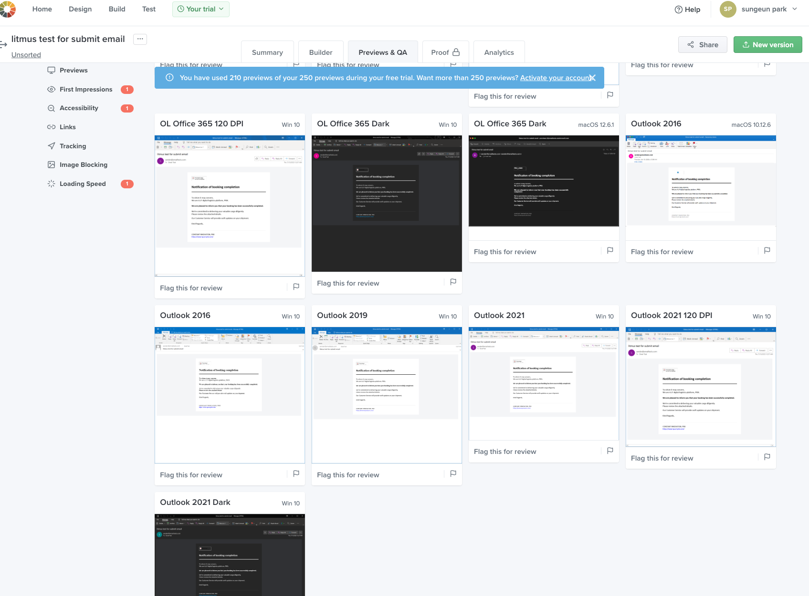

## 배경

### 이메일 템플릿을 구축하게 된 배경

이번에 회사에서 진행하는 프로젝트 내에서 유저에게 발송할 메일 내에 보여질 html template을 작성하여 백엔드 담당자에게 공유해야할 일이 생겼다. 나는 개인적으로 NEWNEEK이라는 시사 뉴스레터를 구독하고 있어서 매일 내 이메일로 시사 뉴스레터가 날아오는데, 이 뉴스레터가 html email template으로 작업된 서비스가 아닐까 한다. (요즘은 뉴스레터를 손쉽게 만들어주는 전문 서비스도 있다고 한다) 또는 각종 결제내역이나, 특정 서비스에 회원 가입 시 가입 승인 안내와 같은 정보성 메일도 전부 이 이메일 템플릿을 통해 구축된다.

### 쉽다고 생각하면 오산이야!

이전에 이메일 코딩을 해본 경험이 없던 나로서는 html 레이아웃만 짜면 되는데 어려울 것 있겠어? 라는 가벼운 마음으로 작업을 시작했다. 그래도 조금만 레퍼런스를 찾아보면 table 관련 태그를 이용하여 작업해야한다는 것 쯤은 알 수 있기에 해당 내용정도만 인지한뒤 작업을 했고, 빠르게 마무리하여 PR을 올렸다. (물론 주요 이메일 플랫폼인 gmail, naver, outlook, daum, 회사에서 사용하는 플랫폼에서 모든 수신 테스팅을 하였고 웹/앱 모두 결과물에 문제가 없는 것도 확인하였다)

그로부터 일주일정도 지났을까. QA 담당자분께서 **고객사 자체 이메일 플랫폼에서 이메일 수신 시 테이블 폼 깨짐☠️** 이라는 타이틀로 티켓을 생성해주셨고, 나는 당분간 열어볼 일 없을 것이라 생각했던 해당 html 코드를 다시 들여다보게 되었다.😇

---

## 문제를 분석해보자

### 이메일 템플릿 코딩의 난이도를 얕잡아봤다

이메일은 과거부터 전통적인 영역으로, 현대 웹의 HTML/CSS를 사용해서 작업하는 경우 많은 예외 상황이 발생할 수 있다. 더불어 다양한 메일 플랫폼과 메일 뷰어에서 각자 지원하거나 / 제한하는 HTML/CSS 영역이 제각각이기에 이러한 부분에서 발생하는 예외 상황을 최소화하기 위해 안정적인 퍼블리싱 방식을 사용해야 한다.

**다양한 메일 플랫폼**

- 나만 해도 네이버, 지메일, 다음/카카오메일에 활성화된 계정이 있고, 회사에서 사용하는 메일 플랫폼의 계정도 따로 있다.
- 국내만 해도 이 정도가 기본 수준인데, 해외에서 주로 사용하는 메일 플랫폼(야후, 아웃룩, 기타 등등)까지 더한다면 그 수가 굉장히 다양하다.

**다양한 메일 뷰어**

- 유저는 **PC Web / Mobile Web / Mobile App과 같이 다양한 뷰어**로 메일을 확인할 수 있다는 사실..!
- 즉, 각종 웹/앱의 브라우저와 앱 자체의 **서로 다른 환경을 모두 서포트할 수 있어야 하기에** 이 부분에서 작업의 난이도가 높아지는 것 같다. 😇

### 유저는 자체적으로 개발한 이메일 플랫폼을 사용하고 있었다

- 주요 이메일 플랫폼과 비교하여 관련 정보를 수집할 수 없는 문제가 있음
- 유저에 직접적인 확인을 요청하기 전에는 수신된 이메일이 어떻게 표기되는지 테스트할 수 없음

---

## 문제를 해결해보자

### 이메일 템플릿 작성 시 주의사항 준수하기

제일 기본적으로 지켜야 할 사항은, 모든 이메일 플랫폼과 뷰어에서 동작할 수 있도록 하위호환성을 지키기 위해 **최신 HTML, CSS 문법 사용을 지양해야 한다는 것**과 **인라인 스타일링**을 적용해야 한다는 것이다.

- 이메일 클라이언트에 적합한 Doctype을 설정 (XHTML 1.0 Transitional doctype)
- table, tr, td와 같은 table 태그를 이용
- 셀을 합쳐야 할 때 colspan, rowspan 등의 HTML 속성을 사용하지 않고 셀 내부에 table 태그로 중첩 테이블을 생성하여 셀 합치기
- 외부 여백 생성 시 margin 속성을 사용하지 않고 빈 공백을 가지는 td 태그에 width 또는 height을 부여해 외부 여백 생성
- padding을 이용한 내부 여백 생성 시 css 단축 속성을 사용하지 않고 모든 side의 값을 지정
  - ex) padding: 10px 20px 10px 20px
  - 위의 예시가 적용되지 않을 경우 padding-top:10px; padding-right:20px; padding-bottom:10px; padding-left:20px; 와 같은 식으로 하나씩 작업해주어야한다.
- 배경색의 경우 css의 background 속성이 아닌 HTML bgcolor 속성을 사용하여 지정
- color 지정 시 hex code 사용

### 이메일 템플릿 테스팅 툴 적극 활용하기

Free trial로 일주일 정도 사용할 수 있었던 Litmus라는 이메일 테스팅 툴.(이외 다른 기능들도 있다)

### 다 확인했다고 생각했는데..?

naver 메일 테스팅에서 테이블 왼쪽 쏠림 현상이 발생했다… 
지메일,아웃룩 등 다른 이메일 플랫폼에서 테스팅 시에는 발생되지 않았던 문제인데, 개발자 도구를 이용해 속성들을 확인해보니
하위 호환성을 맞추느라 align=’center’라는 속성을 이용해 테이블 가운데 정렬을 했는데 요놈이 HTML5 이전에 지원하던 속성이라 특정 이메일 플랫폼에서는 또 호환이 안될수도 있다는 것을 간과했다. 그것이 하필 국내에서 많이 사용하는 naver 플랫폼이 되시겠다.

### 이것도 해결해보자

- 다른 플랫폼 호환성도 생각해야하기에 align=’center’속성을 삭제할 수는 없고, inline css로 margin:0 auto를 추가해주었다.
- 이것 참. 더 아이러니한 것은 모바일(모바일 앱, 모바일 웹)로 수신된 이메일 확인 시 최초에 HTML5와 최신 CSS를 이용해서 작업했던 버전(고객사에서 와장창 깨졌던 그 버전..)이 더 깔끔했다는 것이다.. 크흡
- 하지만 우선 고객사가 웹 버전을 주로 사용한다는 전제 하에 작업하였고, 모바일에서 깨지는 부분은 차차 해결해야할 것으로 보인다. 😇
- 왜 네이버에서만 이런 문제가 났는가 보니, 다른 메일(ex,지메일) 플랫폼에서는 align=’center’속성이 margin: “0 auto”로 자동으로 치환되어 중앙 정렬에 문제가 없기에 쏠림 현상이 없었던 것을 확인했다.

---

## 결론

### 기쁜소식 🌟 

최종 고객사에 테스트 계정을 의뢰하여 테스트를 진행하였고, 깨짐 현상이 해결되었음을 확인하였다!

### 생각해 볼 만한 문제

- 수 많은 메일 플랫폼과 뷰어를 모두 만족시킬 수는 없다. 일정이 급하다면 우선 집중해야 하는 대상이 무엇인지 생각해보자.
- 지금 버전은 웹에서 확인할 때는 다행히 모두 깨지지 않고 잘 보이지만, 모바일로 볼 때는 문제가 있는 경우가 있다. (분명 litmus로 테스팅했을 때 대부분 깨짐이 없었는데, 실제로 수신 테스트를 해보니 모바일 App에서 테이블이 깨지는 부분이 있더라..)
- 그래서, **이렇게 예외 상황이 빈번한 작업을 매번 한땀 한땀 직접 작업할 수 밖에 없는걸까?** 😅
  - 정답은 No! **React Email**이라는 라이브러리를 통해서 리액트를 이용해 보다 쉽게 이메일 템플릿을 만들 수 있다. (이건 다음 편에서 다뤄보겠다.)
  - 아래는 React Email maintainer의 한 마디.
    <aside>
      💡 We believe that email is an extremely important medium for people to
      communicate. However, we need to stop developing emails like 2010, and
      rethink how email can be done in 2022 and beyond. Email development needs
      a revamp. A renovation. Modernized for the way we build web apps today.
    </aside>

이렇게 HTML로 이메일 템플릿 구현작업을 마무리했다. 
소위 테이블 코딩이라고 불리던 테이블 레이아웃을 경험하며, table안에 td안에 table안에 td.. 극악 난이도의 가독성을 가진 코드를 잠깐이나마 경험해보니 HTML5 이후의 시맨틱 웹의 도입이 우리에게 가져다주는 의미는 무엇인지, 기술의 발전이 얼마나 우리에게 편리함을 가져다주는지 더 깊게 이해하는 계기가 되었다.🥲

---

## 참고 링크

- [https://webdesign.tutsplus.com/build-an-html-email-template-from-scratch--webdesign-12770a?ec_unit=translation-info-language](https://webdesign.tutsplus.com/build-an-html-email-template-from-scratch--webdesign-12770a?ec_unit=translation-info-language)
- [https://beagle-dev.tistory.com/243](https://beagle-dev.tistory.com/243)
- [https://www.campaignmonitor.com/css/](https://www.campaignmonitor.com/css/)
- [https://www.litmus.com/](https://www.litmus.com/)
